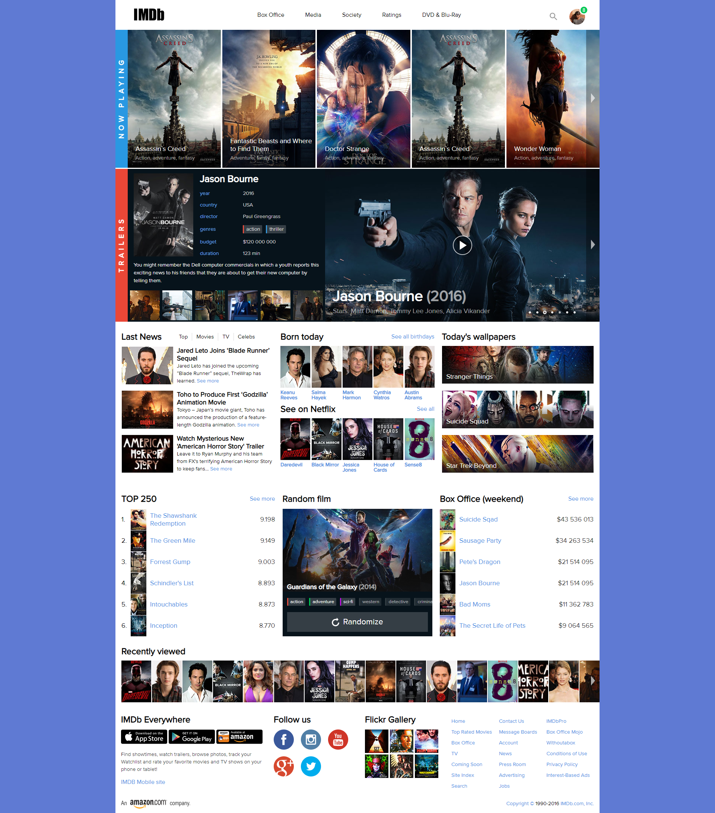

<p align = center>МИНИСТЕРСТВО НАУКИ И ВЫСШЕГО ОБРАЗОВАНИЯ

<p align = center>РОССИЙСКОЙ ФЕДЕРАЦИИ

<p align = center>ФЕДЕРАЛЬНОЕ ГОСУДАРСТВЕННОЕ БЮДЖЕТНОЕ ОБРАЗОВАТЕЛЬНОЕ УЧРЕЖДЕНИЕ ВЫСШЕГО ОБРАЗОВАНИЯ

<p align = center>«ВЯТСКИЙ ГОСУДАРСТВЕННЫЙ УНИВЕРСИТЕТ»

<p align = center>Институт математики и информационных систем

<p align = center>Факультет автоматики и вычислительной техники

<p align = center>Кафедра систем автоматизации управления


<p align = right>Дата сдачи на проверку:

<p align = right>«___» __________ 2021 г.

<p align = right>Проверено:

<p align = right>«___» __________ 2021 г.

<p align = center>Стилизация и трансформация элементов через CSS

<p align = center>Отчет по лабораторной работе № 3

<p align = center>по дисциплине

<p align = center>«Основы frontend-разработки и организации человеко-машинного интерфейса»


<p align = right>Разработал студент гр. ИТб-2301-01-00 ________________ /Фищев А.В./

<p align = right>Проверил ст. преподаватель _________________ /Земцов М.А./

<p align = right>Работа защищена с оценкой	«___________» «___» __________ 2021 г.


<p align = center>Киров 2021

## Цель лабораторной работы: 
Стилизация и трансформация элементов через CSS. CSS процессоры.

## Задачи:
1. Организовать процесс работы над лабораторной работой
2. Изучить материал по основам стилизации элементов
3. Выполнить верстку макета по заданию преподавателя
4. Составить отчет по выполненным задачам
5. Защитить лабораторную работу

## Ход выполнения:

1. Организовать процесс работы над лабораторной работой

В ходе организации рабочего пространства в репозитории “Basic frontend dev labs” создана ветвь “lab3”.

2. Изучить материал по основам стилизации элементов

Перед началом выполнения работы был изучен материал по основам работы c оформлением веб-документа.

3. Выполнить верстку веб-страницы

Макет веб-страницы представлен на рисунке 1.

<p align=center></p>

<p align=center>Рисунок 1 - Макет веб-страницы</p>

Макет при открытии онлайн, не подгружал шрифты. Неоходимо было самостоятельно загрузить шрифт на компьютер и сохранить макет локально.
На рисунке 2 продемострирован правильно отображенный макет.

<p align=center></p>

<p align=center>Рисунок 2 - Корректно отображенный макет</p>

Выполненное задание представлено на рисунке 3. Листинг html страницы представлен в приложении А. Листинг css представлен в приложении Б

<p align=center></p>

<p align=center>Рисунок 3 - Выполненная верстка</p>

4. Составить отчет по выполненным задачам

При составлении отчета были закреплены навыки по markdown разметке  и общие требования к оформлению текстовых документов.

Вывод: в ходе работы была изучена документация по cтилизации и трансформации элементов с помощью CSS. Также был получен опыт в применении CSS-стилей.


<p align = center><b>Приложение А</b>

<p align = center>(обязательное) 

<p align = center><b>Листинг html-страницы</b>

```html
<!DOCTYPE html>
<html lang="ru">
    <head>
        <meta charset="UTF-8" />
        <meta http-equiv="X-UA-Compatible" content="IE=edge" />
        <meta name="viewport" content="width=device-width, initial-scale=1.0" />
        <link rel="stylesheet" href="style.css" />
        <link rel="stylesheet" href="normalize.css" />
        <title>IMDb</title>
    </head>
    <body>
        <div class="wrapper">
            <header class="header">
                <a href="#">
                    
                </a>
                <nav>
                    <ul class="navmenu">
                        <li class="navmenu-item">
                            <a href="#" class="navmenu-item__link">
                                Box Office
                            </a>
                        </li>
                        <li class="navmenu-item">
                            <a href="#" class="navmenu-item__link"> Media </a>
                        </li>
                        <li class="navmenu-item">
                            <a href="#" class="navmenu-item__link"> Society </a>
                        </li>
                        <li class="navmenu-item">
                            <a href="#" class="navmenu-item__link"> Ratings </a>
                        </li>
                        <li class="navmenu-item">
                            <a href="#" class="navmenu-item__link">
                                DVD & Blu-Ray
                            </a>
                        </li>
                    </ul>
                </nav>
                <aside>
                    
                    
                </aside>
            </header>

            <main>
                <section class="actual-films">
                    <button class="now-playing">
                        <span class="vert-text">NOW PLAYING</span>
                    </button>
                    <div class="film-card assassins-creed">
                        <h2 class="film-card__name">Assassin`s Creed</h2>
                        <p class="film-card__ganre">
                            Action, adventure, fantasy
                        </p>
                    </div>
                    <div class="film-card fantastic-beasts">
                        <h2 class="film-card__name">
                            Fantastic Beasts and Where to Find Them
                        </h2>
                        <p class="film-card__ganre">
                            Adventure, family, fantasy
                        </p>
                    </div>
                    <div class="film-card doctor-strange">
                        <h2 class="film-card__name">Doctor Strange</h2>
                        <p class="film-card__ganre">
                            Action, adventure, fantasy
                        </p>
                    </div>
                    <div class="film-card assassins-creed">
                        <h2 class="film-card__name">Assassin`s Creed</h2>
                        <p class="film-card__ganre">
                            Action, adventure, fantasy
                        </p>
                    </div>
                    <div class="film-card wonder-woman non-mar">
                        <button class="btn-next">
                            
                        </button>
                        <h2 class="film-card__name">Wonder Woman</h2>
                        <p class="film-card__ganre">
                            Action, adventure, fantasy
                        </p>
                    </div>
                </section>

                <section class="jason">
                    <button class="trailers">
                        <span class="vert-text">TRAILERS</span>
                    </button>

                    <div class="film-info">
                        <div class="film-info__main">
                            <div class="info-text">
                                

                                <div class="info-main">
                                    <h2 class="info-main__title">
                                        Jason Bourne
                                    </h2>

                                    <div class="info-item">
                                        <p class="info-item__title">year</p>
                                        <div class="info-item__sub">2016</div>
                                    </div>

                                    <div class="info-item">
                                        <p class="info-item__title">country</p>
                                        <div class="info-item__sub">USA</div>
                                    </div>

                                    <div class="info-item">
                                        <p class="info-item__title">director</p>
                                        <div class="info-item__sub">
                                            Paul Greengrass
                                        </div>
                                    </div>

                                    <div class="info-item">
                                        <p class="info-item__title">genres</p>
                                        <div class="info-item__sub">
                                            <div class="genre genre_action">
                                                action
                                            </div>
                                            <div class="genre genre_thriller">
                                                thriller
                                            </div>
                                        </div>
                                    </div>

                                    <div class="info-item">
                                        <p class="info-item__title">budget</p>
                                        <div class="info-item__sub">
                                            $120 000 000
                                        </div>
                                    </div>

                                    <div class="info-item">
                                        <p class="info-item__title">duration</p>
                                        <div class="info-item__sub">
                                            123 min
                                        </div>
                                    </div>
                                </div>
                            </div>

                            <div class="film-info__text">
                                You might remember the Dell computer commercials
                                in which a youth reports this exciting news to
                                his friends that they are about to get their new
                                computer by telling them.
                            </div>
                        </div>

                        <div class="film-info__pictures">
                            
                            
                            
                            
                            
                            
                        </div>
                    </div>

                    <div class="jason-main">
                        <button class="btn-next">
                            
                        </button>
                        

                        <h2 class="jason-main__name">
                            Jason Bourne
                            <span style="color: #ffffff9e">(2016)</span>
                        </h2>
                        
                        <p class="jason-main__ganre">
                            Stars: Matt Damon, Tommy Lee Jones, Alicia Vikander
                        </p>
                    </div>
                </section>

                <section class="news">
                    <div class="last-news">
                        <div class="news-header">
                            <h2 class="news-header__title">Last News</h2>
                            <ul class="news-nav">
                                <li class="news-nav__item">Top</li>
                                <li class="news-nav__item">Movies</li>
                                <li class="news-nav__item">TV</li>
                                <li class="news-nav__item">Celebs</li>
                            </ul>
                        </div>

                        <div class="news-item">
                            
                            <div class="news-item__main">
                                <h2 class="news-item__title">
                                    Jared Leto Joins ‘Blade Runner’ Sequel
                                </h2>
                                <p class="news-item__text">
                                    Jared Leto has joined the upcoming “Blade
                                    Runner” sequel, TheWrap has learned.
                                    <a href="" class="text-link">See more</a>
                                </p>
                            </div>
                        </div>

                        <div class="news-item">
                            
                            <div class="news-item__main">
                                <h2 class="news-item__title">
                                    Toho to Produce First ‘Godzilla’ Animation
                                    Movie
                                </h2>
                                <p class="news-item__text">
                                    Tokyo – Japan’s movie giant, Toho has
                                    announced the production of a feature-length
                                    Godzilla animation.
                                    <a href="" class="text-link">See more</a>
                                </p>
                            </div>
                        </div>

                        <div class="news-item">
                            
                            <div class="news-item__main">
                                <h2 class="news-item__title">
                                    Watch Mysterious New 'American Horror Story'
                                    Trailer
                                </h2>
                                <p class="news-item__text">
                                    Leave it to Ryan Murphy and his team from
                                    FX's terrifying American Horror Story to
                                    keep fans…
                                    <a href="" class="text-link">See more</a>
                                </p>
                            </div>
                        </div>
                    </div>

                    <div class="news-block-2">
                        <div class="block">
                            <div class="block-header">
                                <h2 class="block-header__title">Born today</h2>
                                <a href="#" class="block-header__subtitle"
                                    >See all birthdays
                                </a>
                            </div>

                            <div class="cards-block">
                                <div class="card">
                                    
                                    <h3 class="card__name">
                                        Keanu <br />
                                        Reeves
                                    </h3>
                                </div>

                                <div class="card">
                                    
                                    <h3 class="card__name">
                                        Salma <br />
                                        Hayek
                                    </h3>
                                </div>

                                <div class="card">
                                    
                                    <h3 class="card__name">
                                        Mark <br />
                                        Harmon
                                    </h3>
                                </div>

                                <div class="card">
                                    
                                    <h3 class="card__name">
                                        Cynthia <br />
                                        Watros
                                    </h3>
                                </div>

                                <div class="card">
                                    
                                    <h3 class="card__name">
                                        Austin <br />
                                        Abrams
                                    </h3>
                                </div>
                            </div>
                        </div>

                        <div class="block">
                            <div class="block-header">
                                <h2 class="block-header__title">
                                    See on Netflix
                                </h2>
                                <a href="#" class="block-header__subtitle">
                                    See all
                                </a>
                            </div>

                            <div class="cards-block">
                                <div class="card">
                                    
                                    <h3 class="card__name">Daredevil</h3>
                                </div>

                                <div class="card">
                                    
                                    <h3 class="card__name">Black Mirror</h3>
                                </div>

                                <div class="card">
                                    
                                    <h3 class="card__name">
                                        Jessica <br />
                                        Jones
                                    </h3>
                                </div>

                                <div class="card">
                                    
                                    <h3 class="card__name">
                                        House of <br />
                                        Cards
                                    </h3>
                                </div>

                                <div class="card">
                                    
                                    <h3 class="card__name">Sense8</h3>
                                </div>
                            </div>
                        </div>
                    </div>

                    <div class="wallpapers">
                        <h2 class="wallpapers-title">Today's wallpapers</h2>
                        <div class="wallpapers-items">
                            <div class="wall-item">
                                <a
                                    href="#"
                                    class="
                                        wall-item__link
                                        wall-item__link_stanger-things
                                    "
                                >
                                    <span>Stranger Things</span>
                                </a>
                            </div>

                            <div class="wall-item">
                                <a
                                    href="#"
                                    class="
                                        wall-item__link
                                        wall-item__link_suicide-squad
                                    "
                                >
                                    <span>Suicide Squad</span>
                                </a>
                            </div>

                            <div class="wall-item">
                                <a
                                    href="#"
                                    class="
                                        wall-item__link
                                        wall-item__link_star-trek
                                    "
                                >
                                    <span>Star Trek Beyond</span>
                                </a>
                            </div>
                        </div>
                    </div>
                </section>

                <section class="tops">
                    <div class="bloct-list bloct-list_pl">
                        <div class="block-header block-header_margin">
                            <h2 class="block-header__title">TOP 250</h2>
                            <a href="#" class="block-header__subtitle">
                                See more
                            </a>
                        </div>

                        <div class="list-item">
                            <div class="main-item-list b1">
                                
                                <p class="main-item-list__name">
                                    The Shawshank <br />
                                    Redemption
                                </p>
                            </div>
                            <p class="count">9.198</p>
                        </div>

                        <div class="list-item">
                            <div class="main-item-list b2">
                                
                                <p class="main-item-list__name">
                                    The Green Mile
                                </p>
                            </div>
                            <p class="count">9.149</p>
                        </div>

                        <div class="list-item">
                            <div class="main-item-list b3">
                                
                                <p class="main-item-list__name">Forrest Gump</p>
                            </div>
                            <p class="count">9.003</p>
                        </div>

                        <div class="list-item">
                            <div class="main-item-list b4">
                                
                                <p class="main-item-list__name">
                                    Schindler's List
                                </p>
                            </div>
                            <p class="count">8.893</p>
                        </div>

                        <div class="list-item">
                            <div class="main-item-list b5">
                                
                                <p class="main-item-list__name">Intouchables</p>
                            </div>
                            <p class="count">8.873</p>
                        </div>

                        <div class="list-item">
                            <div class="main-item-list b6">
                                
                                <p class="main-item-list__name">Inception</p>
                            </div>
                            <p class="count">8.770</p>
                        </div>
                    </div>

                    <div class="random">
                        <div class="block-header block-header_margin">
                            <h2 class="block-header__title">Random film</h2>
                        </div>
                        <div class="random-main__name">
                            <h2>
                                Guardians of the Galaxy
                                <span style="color: #ffffff9e">(2014)</span>
                            </h2>
                        </div>
                        <div class="btns">
                            <div class="genres-btn">
                                <div class="genre genre_action">action</div>
                                <div class="genre genre_adventure">
                                    adventure
                                </div>
                                <div class="genre genre_sci-fi">sci-fi</div>
                                <div class="genre genre_off">western</div>
                                <div class="genre genre_off">detective</div>
                                <div class="genre genre_off">criminal</div>
                            </div>
                            <button class="randomize">
                                
                                Randomize
                            </button>
                        </div>
                    </div>

                    <div class="bloct-list bloct-list_pr">
                        <div class="block-header block-header_margin">
                            <h2 class="block-header__title">
                                Box Office (weekend)
                            </h2>
                            <a href="#" class="block-header__subtitle">
                                See more
                            </a>
                        </div>

                        <div class="list-item">
                            <div class="main-item-list">
                                
                                <p class="main-item-list__name">Suicide Sqad</p>
                            </div>
                            <p class="count">$43 536 013</p>
                        </div>

                        <div class="list-item">
                            <div class="main-item-list">
                                
                                <p class="main-item-list__name">
                                    Sausage Party
                                </p>
                            </div>
                            <p class="count">$34 263 534</p>
                        </div>

                        <div class="list-item">
                            <div class="main-item-list">
                                
                                <p class="main-item-list__name">
                                    Pete's Dragon
                                </p>
                            </div>
                            <p class="count">$21 514 095</p>
                        </div>

                        <div class="list-item">
                            <div class="main-item-list">
                                
                                <p class="main-item-list__name">Jason Bourne</p>
                            </div>
                            <p class="count">$21 514 095</p>
                        </div>

                        <div class="list-item">
                            <div class="main-item-list">
                                
                                <p class="main-item-list__name">Bad Moms</p>
                            </div>
                            <p class="count">$11 362 783</p>
                        </div>

                        <div class="list-item">
                            <div class="main-item-list">
                                
                                <p class="main-item-list__name">
                                    The Secret Life of Pets
                                </p>
                            </div>
                            <p class="count">$9 064 565</p>
                        </div>
                    </div>
                </section>

                <section class="recently">
                    <h2 class="recently__title">Recently viewed</h2>
                    <div class="cascade">
                        <button class="btn-next">
                            
                        </button>
                        
                        
                        
                        
                        
                        
                        
                        
                        
                        
                        
                        
                        
                        
                        
                        
                    </div>
                </section>
            </main>

            <footer>
                <div class="f-block">
                    <h2 class="f-block__title">IMDb Everywhere</h2>
                    <div class="icons-1">
                        
                        
                        
                    </div>
                    <p class="f-block__text">
                        Find showtimes, watch trailers, browse photos, track
                        your <br />
                        Watchlist and rate your favorite movies and TV shows on
                        your <br />
                        phone or tablet!
                    </p>
                    <a href="#" class="f-block__link">IMDB Mobile site</a>
                </div>

                <div class="f-block">
                    <h2 class="f-block__title">Follow us</h2>
                    <div class="icons">
                        
                        
                        
                        
                        
                    </div>
                </div>

                <div class="f-block">
                    <h2 class="f-block__title">Flickr Gallery</h2>
                    <div class="icons-3">
                        
                        
                        
                        
                        
                        
                    </div>
                </div>

                <div class="link-block">
                    <a href="#" class="link-block__item">Home</a>
                    <a href="#" class="link-block__item">Top Rated Movies</a>
                    <a href="#" class="link-block__item">Box Office</a>
                    <a href="#" class="link-block__item">TV</a>
                    <a href="#" class="link-block__item">Coming Soon</a>
                    <a href="#" class="link-block__item">Site Index</a>
                    <a href="#" class="link-block__item">Search</a>
                    <a href="#" class="link-block__item">Contact Us</a>
                    <a href="#" class="link-block__item">Message Boards</a>
                    <a href="#" class="link-block__item">Account</a>
                    <a href="#" class="link-block__item">News</a>
                    <a href="#" class="link-block__item">Press Room</a>
                    <a href="#" class="link-block__item">Advertising</a>
                    <a href="#" class="link-block__item">Jobs</a>
                    <a href="#" class="link-block__item">IMDbPro</a>
                    <a href="#" class="link-block__item">Box Office Mojo</a>
                    <a href="#" class="link-block__item">Withoutabox</a>
                    <a href="#" class="link-block__item">Conditions of Use</a>
                    <a href="#" class="link-block__item">Privacy Policy</a>
                    <a href="#" class="link-block__item">Interest-Based Ads</a>
                </div>
            </footer>

            <footer class="com">
                
                <p>
                    Copyright ©
                    <span style="color: black">1990-2016</span> IMDb.com, Inc.
                </p>
            </footer>
        </div>
    </body>
</html>


```

<p align = center><b>Приложение Б</b>

<p align = center>(обязательное) 

<p align = center><b>Листинг css-файла</b>

```css
@font-face {
    font-family: ProximaNova;
    src: url(./fonts/ofont.ru_Proxima\ Nova.ttf);
}

* {
    box-sizing: border-box;
}

button {
    cursor: pointer;
}

body {
    background: #5f7ad3;
    font-size: 16px;
}

.wrapper {
    display: flex;
    flex-direction: column;

    max-width: 1300px;
    margin: 0 auto;
    background-color: #fff;
}

.header {
    display: flex;
    flex-direction: row;
    justify-content: space-between;
    align-items: center;

    width: 95%;
    height: 80px;

    margin: 0 auto;
}

.navmenu {
    display: flex;
    height: 80px;
    list-style: none;

    margin: 0;
    padding: 0;
}

.navmenu-item {
    height: 100%;
}

.navmenu-item__link {
    display: flex;
    justify-content: center;
    align-items: center;

    font-size: 1em;
    height: 100%;

    color: black;
    text-decoration: none;
    font-family: ProximaNova;
    line-height: 19px;

    padding: 0 28px 0 28px;
}

.navmenu-item__link:hover {
    color: white;
    background-color: #ea4737;
}

aside {
    display: flex;
    justify-content: space-between;
    align-items: center;
}

.search {
    margin-top: 5px;
    padding-right: 26px;
}

.actual-films {
    height: 370px;

    display: flex;
    flex-direction: row;
}

.now-playing {
    border: 0;
    background-color: #2998e2;
    color: #fff;

    font-family: ProximaNova;
    font-weight: bold;
    font-size: 19px;
}

.vert-text {
    writing-mode: vertical-lr;
    transform: rotate(-180deg);
    letter-spacing: 8.55px;
}

.film-card {
    width: 252px;
    height: 370px;
    margin-right: 4px;

    display: flex;
    flex-direction: column;
    justify-content: flex-end;
}

.non-mar {
    margin-right: 0;
}

.film-card__name {
    font-family: ProximaNova;
    font-size: 18px;
    line-height: 21px;
    font-style: normal;
    font-weight: normal;
    color: #fff;

    padding: 0;
    margin: 0 0 6px 21px;
}

.film-card__ganre {
    font-family: ProximaNova;
    font-size: 14px;
    line-height: 16px;
    font-style: normal;
    font-weight: normal;
    color: #ffffff95;

    padding: 0;
    margin: 0 0 18px 21px;
}

.assassins-creed {
    background-image: linear-gradient(
            180deg,
            rgba(0, 0, 0, 0.00006) 64.13%,
            rgba(0, 0, 0, 0.6) 100%
        ),
        url(./image/actual-films/assassins-creed.png);
    background-repeat: no-repeat;
    background-size: cover;
    background-position: center;
}

.fantastic-beasts {
    background-image: linear-gradient(
            180deg,
            rgba(0, 0, 0, 0.00006) 64.13%,
            rgba(0, 0, 0, 0.6) 100%
        ),
        url(./image/actual-films/fantastic-beasts.png);
    background-repeat: no-repeat;
    background-size: cover;
    background-position: center;
}

.doctor-strange {
    background-image: linear-gradient(
            180deg,
            rgba(0, 0, 0, 0.00006) 64.13%,
            rgba(0, 0, 0, 0.6) 100%
        ),
        url(./image/actual-films/doctor-strange.png);
    background-repeat: no-repeat;
    background-size: cover;
    background-position: center;
}

.wonder-woman {
    background-image: linear-gradient(
            180deg,
            rgba(0, 0, 0, 0.00006) 64.13%,
            rgba(0, 0, 0, 0.6) 100%
        ),
        url(./image/actual-films/wonder-woman.png);
    background-repeat: no-repeat;
    background-size: cover;
    background-position: center;

    position: relative;
}

.btn-next {
    border: none;
    background-color: rgba(0, 0, 0, 0.336);

    position: absolute;
    top: 0;
    right: 0;

    width: 36px;
    height: 100%;
}

.btn-next__ico {
    opacity: 80%;
    color: white;
}

.jason {
    height: 410px;
    display: flex;
    flex-direction: row;
    margin-top: 3px;
}

.trailers {
    border: 0;
    background-color: #ea4737;
    color: #fff;

    font-family: ProximaNova;
    font-weight: bold;
    font-size: 19px;
}

.film-info {
    width: 530px;
    background-color: #07131b;
    display: flex;
    flex-direction: row;
    flex-wrap: wrap;
    justify-content: center;
}

.film-info__main {
    margin: 16px;
    margin-top: 12px;
}

.info-text {
    display: flex;
    flex-direction: row;
}

.film-info__logo {
    display: block;
    width: 159.91px;
    height: 223px;
}

.info-main {
    display: flex;
    flex-direction: column;

    flex-grow: 1;
    margin: 0 32px 0 18px;
}

.info-main__title {
    display: block;

    font-family: ProximaNova;
    font-size: 26px;
    line-height: 30px;
    color: #fff;
    margin: 0;
    margin-bottom: 1px;
}

.info-item {
    display: flex;
    flex-direction: row;
    margin-top: 15px;
}

.info-item__title {
    display: block;
    margin: auto 0;

    color: #70b0ff;
    font-family: ProximaNova;
    font-size: 14px;
    line-height: 16px;

    width: 40%;
}

.info-item__sub {
    display: flex;
    color: #ffffffcb;

    font-family: ProximaNova;
    font-size: 14px;
    line-height: 16px;
}


.genre {
    background: #ffffff2f;
    border-radius: 2px;
    padding: 3px 6px;
    margin-right: 10px;
    border-left: solid 3px;
}

.genre_action {
    border-color: #e74c3c;
}

.genre_thriller {
    border-color: #3498db;
}

.genre_adventure {
    border-color: #00c853;
}

.genre_sci-fi {
    border-color: #BD10E0;
}

.genre_off {
    background: #ffffff1b;
    color: #ffffff96;
    border-color: #ffffff13;;
}

.film-info__text {
    color: #fff;

    font-family: ProximaNova;
    font-style: normal;
    font-weight: normal;
    font-size: 14px;
    line-height: 21px;

    margin-top: 12px;
}

.film-info__pictures {
    display: flex;
    flex-direction: row;
    justify-content: space-evenly;
    width: 100%;
    height: 84px;
    padding: 0;
}

.film-info__pictures > img {
    margin: 0 2px 4px 2px;
}

.jason-main {
    background-image: linear-gradient(
            180deg,
            rgba(0, 0, 0, 0.00006) 64.13%,
            rgba(0, 0, 0, 0.6) 100%
        ),
        url(./image/jason/main.png);
    background-repeat: no-repeat;
    background-size: cover;
    background-position: center;

    flex-grow: 1;
    height: 100%;

    position: relative;
    display: flex;
    flex-direction: column;
    justify-content: flex-end;
}

.jason-main__play {
    position: absolute;

    width: 52px;
    height: 52px;

    margin: auto;
    top: 0;
    left: 0;
    bottom: 0;
    right: 0;

    cursor: pointer;
}

.jason-main__points {
    position: absolute;
    bottom: 20px;
    right: 64px;
}

.jason-main__name {
    font-family: ProximaNova;

    font-size: 40px;
    line-height: 46px;
    color: #fff;

    padding: 0;
    margin: 0 0 6px 21px;
}

.jason-main__ganre {
    font-family: ProximaNova;

    font-size: 18px;
    line-height: 21px;
    color: #ffffff95;

    padding: 0;
    margin: 0 0 18px 21px;
}

.news {
    /* height: 410px; */

    display: flex;
    flex-direction: row;

    margin-top: 30px;
}

.last-news {
    display: flex;
    flex-direction: column;
    flex: 0 0 33.33%;
    padding-right: 10px;
}

.news-header {
    display: flex;
    flex-direction: row;
    align-items: center;

    padding: 0;
}

.news-header__title {
    display: block;

    font-family: ProximaNova;
    font-size: 24px;
    line-height: 21px;

    padding: 0;
    margin: 0;
    margin-left: 16px;
    margin-right: 35px;
}

.news-nav {
    display: flex;
    flex-direction: row;
    padding: 0;
    margin: 0;
}

.news-nav__item {
    list-style: none;
    border-right: solid 1px #00000024;

    padding-left: 11px;
    padding-right: 11px;

    font-family: ProximaNova;
    font-size: 15px;
    line-height: 21px;

    cursor: pointer;
}

.news-nav__item:last-child {
    border: none;
}

.news-item {
    display: flex;
    flex-direction: row;
    align-items: center;
}

.news-item_image {
    display: block;
    margin: 16px 10px 0 16px;
}

.news-item__title {
    font-family: ProximaNova;
    font-size: 18px;
    line-height: 21px;

    margin: 0;
    padding: 0;

    margin-top: 16px;
}

.news-item__text {
    font-family: ProximaNova;
    font-size: 14px;
    line-height: 20px;

    margin: 0;
    padding: 0;
}

.news-item__text > a {
    color: #4a90e2;
    text-decoration: none;
}

.news-block-2 {
    display: flex;
    flex-direction: column;
    justify-content: space-between;
    flex: 0 0 33.33%;

    padding: 0 10px;
}

.block {
    display: flex;
    flex-direction: column;
}

.block-header {
    display: flex;
    flex-direction: row;
    justify-content: space-between;
    align-items: center;
}

.block-header > * {
    display: block;
}

.block-header__title {
    font-family: ProximaNova;
    font-size: 24px;
    line-height: 21px;
    margin: 0;
}

.block-header__subtitle {
    font-family: ProximaNova;
    font-size: 16px;
    line-height: 21px;
    text-decoration: none;
    color: #4a90e2;
}

.cards-block {
    display: flex;
    flex-direction: row;
    justify-content: space-between;
    flex-wrap: wrap;

    margin-top: 14px;
}

.card {
    display: flex;
    flex-direction: column;
    align-items: flex-start;
}

.card > * {
    display: block;
}

.card__image {
    width: 80px;
    height: 112px;
}

.card__name {
    font-family: ProximaNova;
    font-size: 14px;
    line-height: 14px;

    color: #4a90e2;

    margin: 0;
    margin-top: 6px;
}

.wallpapers {
    flex: 0 0 33.33%;
    display: flex;
    flex-direction: column;
    padding-left: 10px;
    padding-right: 16px;
}

.wallpapers > * {
    display: block;
}

.wallpapers-title {
    margin: 0;

    font-family: ProximaNova;
    font-size: 24px;
    line-height: 21px;
}

.wallpapers-items {
    display: flex;
    flex-direction: column;
    justify-content: space-between;
    flex-grow: 1;
    margin-top: 14px;
}

.wall-item {
    width: 100%;
    height: 101px;
    display: block;
}

.wall-item__link {
    display: block;
    width: 100%;
    height: 100%;

    text-decoration: none;
    color: #fff;

    font-family: ProximaNova;
    font-size: 18px;
    line-height: 21px;

    position: relative;

    background-repeat: no-repeat;
    background-size: cover;
    background-position: center;
}

.wall-item__link > span {
    position: absolute;

    bottom: 8px;
    left: 12px;
}

.wall-item__link_stanger-things {
    background-image: linear-gradient(
            180deg,
            rgba(0, 0, 0, 0.0001) 37.41%,
            rgba(23, 23, 23, 0.917403) 100%
        ),
        url(./image/news/block-2/wallpapers/Object-2.png);
}

.wall-item__link_suicide-squad {
    background-image: linear-gradient(
            180deg,
            rgba(0, 0, 0, 0.0001) 37.41%,
            rgba(23, 23, 23, 0.917403) 100%
        ),
        url(./image/news/block-2/wallpapers/Object-1.png);
}

.wall-item__link_star-trek {
    background-image: linear-gradient(
            180deg,
            rgba(0, 0, 0, 0.0001) 37.41%,
            rgba(23, 23, 23, 0.917403) 100%
        ),
        url(./image/news/block-2/wallpapers/Object.png);
}

.tops {
    margin: 60px 16px 0 16px;

    display: flex;
    flex-direction: row;
}

.bloct-list {
    flex: 0 0 33.33%;
    padding: 0 10px;
}

.bloct-list_pr {
    padding-right: 0;
}

.bloct-list_pl {
    padding-left: 0;
}

.block-header_margin {
    margin-bottom: 16px;
}

.list-item {
    display: flex;
    flex-direction: row;
    align-items: center;
    justify-content: space-between;
}

.main-item-list {
    display: flex;
    flex-direction: row;
    align-items: center;
}

.main-item-list__image {
    width: 42px;
    height: 56px;
    margin-right: 10px;
}

.main-item-list__name {
    font-family: ProximaNova;
    font-size: 18px;
    line-height: 21px;

    color: #4a90e2;
    margin: 0;
}

.count {
    font-family: ProximaNova;
    font-size: 18px;
    line-height: 21px;

    color: #000000cb;
}

.b1::before {
    content: "1.";
    display: block;
    font-size: 18px;
    line-height: 21px;
    font-family: ProximaNova;
    width: 15px;
    margin-right: 10px;
}

.b2::before {
    content: "2.";
    display: block;
    font-size: 18px;
    line-height: 21px;
    font-family: ProximaNova;
    width: 15px;
    margin-right: 10px;
}

.b3::before {
    content: "3.";
    display: block;
    font-size: 18px;
    line-height: 21px;
    font-family: ProximaNova;
    width: 15px;
    margin-right: 10px;
}

.b4::before {
    content: "4.";
    display: block;
    font-size: 18px;
    line-height: 21px;
    font-family: ProximaNova;
    width: 15px;
    margin-right: 10px;
}

.b5::before {
    content: "5.";
    display: block;
    font-size: 18px;
    line-height: 21px;
    font-family: ProximaNova;
    width: 15px;
    margin-right: 10px;
}

.b6::before {
    content: "6.";
    display: block;
    font-size: 18px;
    line-height: 21px;
    font-family: ProximaNova;
    width: 15px;
    margin-right: 10px;
}

.random {
    display: flex;
    flex-direction: column;
    flex: 0 0 33.33%;
    padding: 0 10px;
}

.random-main__name {
    font-family: ProximaNova;
    font-size: 18px;
    line-height: 21px;
    color: #fff;

    position: relative;

    flex-grow: 1;
    align-items: flex-end;

    background-image: linear-gradient(
            180deg,
            rgba(0, 0, 0, 0.0001) 12.07%,
            rgba(23, 23, 23, 0.713796) 100%
        ),
        url(./image/tops/guardians-of-the-galaxy-poster.png);

    background-size: cover;
}

.random-main__name > h2 {
    font-family: ProximaNova;
    font-size: 18px;
    line-height: 21px;
    color: #fff;

    margin: 0;

    position: absolute;
    bottom: 2px;
    left: 12px;
}

.btns {
    display: flex;
    flex-direction: column;
    padding: 17px 12px 12px 12px;
    background-color: #07131b;
}

.genres-btn {
    margin-bottom: 17px;

    width: 200%;

    color: #fff;
    font-family: ProximaNova;
    font-size: 13px;
    line-height: 15px;
}

.genres-btn > .genre {
    float: left;
}

.btns > button {
    background: rgba(255, 255, 255, 0.185292);
    border: none;

    display: flex;
    justify-content: center;
    align-items: center;

    color: #fff;

    font-family: ProximaNova;
    font-size: 22px;
    line-height: 25px;

    height: 53px;
}

.btns > button > img {
    padding-right: 10px;
}

.recently {
    margin: 30px 0 0 16px;
}

.cascade {
    position: relative;
    display: flex;
}

.recently__title {
    margin: 0 0 14px 0;

    font-family: ProximaNova;
    font-size: 24px;
    line-height: 21px;
}

.cascade__image {
    padding-right: 2px;
}

footer {
    display: flex;
    flex-direction: row;

    margin: 36px 0 11px 0;
    height: 210px;
}

.f-block {
    display: flex;
    flex-direction: column;

    margin: 0 15px 0 15px;
}

.f-block__title {
    margin: 0;

    font-family: ProximaNova;
    font-size: 24px;
    line-height: 21px;

    margin-bottom: 16px;
}

.f-block__text {
    font-family: ProximaNova;
    font-size: 14px;
    line-height: 20px;

    color: #000000cb;
}

.f-block__link {
    font-family: ProximaNova;
    font-size: 16px;
    line-height: 21px;
    text-decoration: none;

    color: #4a90e2;
}

.icons {
    width: 215px;
}

.icons__item {
    padding-right: 15px;
    padding-bottom: 14px;
}

.icons-3 {
    flex-wrap: wrap;
    width: 202px;
}

.link-block {
    display: flex;
    flex-direction: column;
    flex-wrap: wrap;
    flex-grow: 1;

    margin: 0 15px 0 15px;
}

.link-block__item {
    color: #4a90e2;
    text-decoration: none;

    font-family: ProximaNova;
    font-size: 14px;
    line-height: 29px;

    display: block;
    width: 33%;
}

.com {
    height: 100%;
    margin: 0 15px 11px 15px;
    display: flex;
    flex-direction: row;
    justify-content: space-between;
}

.com > p {
    margin: 0;
    padding: 0;

    color: #4a90e2;

    font-family: ProximaNova;
    font-size: 14px;
    line-height: 29px;
}

```

<p align = center><b>Приложение В</b>

<p align = center>(справочное)

<p align = center><b>Библиографический список</b>


1. Руководство по оформлению Markdown файлов [Электронный ресурс] // URL: <https://gist.github.com/Jekins/2bf2d0638163f1294637> (дата обращения: 10.11.2021)

1. Основы CSS [Электронный ресурс] // URL: <<https://html5book.ru/osnovy-css/>> (дата обращения: 09.11.2021)