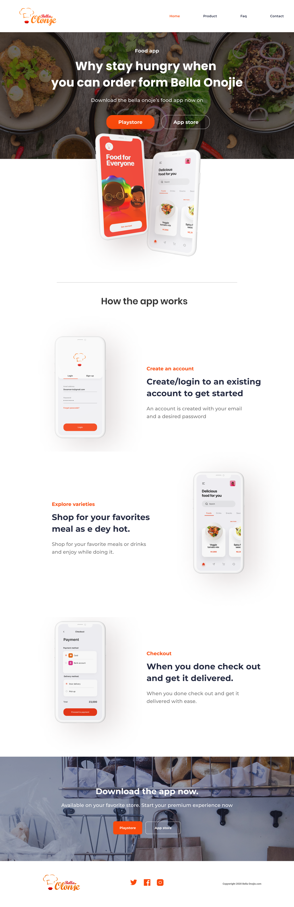
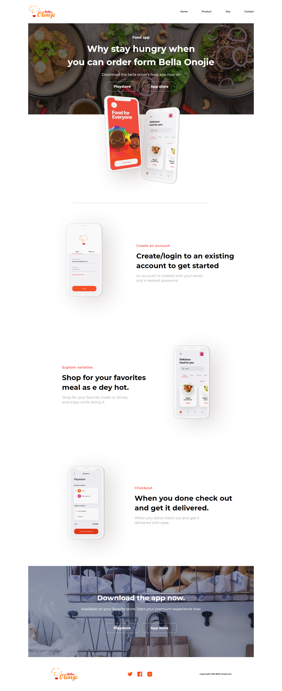
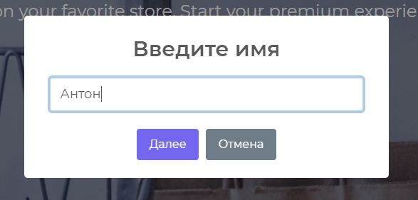
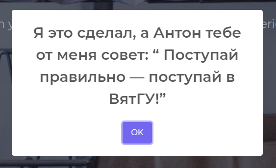

<p align = center>МИНИСТЕРСТВО НАУКИ И ВЫСШЕГО ОБРАЗОВАНИЯ

<p align = center>РОССИЙСКОЙ ФЕДЕРАЦИИ

<p align = center>ФЕДЕРАЛЬНОЕ ГОСУДАРСТВЕННОЕ БЮДЖЕТНОЕ ОБРАЗОВАТЕЛЬНОЕ УЧРЕЖДЕНИЕ ВЫСШЕГО ОБРАЗОВАНИЯ

<p align = center>«ВЯТСКИЙ ГОСУДАРСТВЕННЫЙ УНИВЕРСИТЕТ»

<p align = center>Институт математики и информационных систем

<p align = center>Факультет автоматики и вычислительной техники

<p align = center>Кафедра систем автоматизации управления

<p align = right>Дата сдачи на проверку:

<p align = right>«___» __________ 2021 г.

<p align = right>Проверено:

<p align = right>«___» __________ 2021 г.

<p align = center>Изучение основ языка JavaScript

<p align = center>Отчет по лабораторной работе № 4

<p align = center>по дисциплине

<p align = center>«Основы frontend-разработки и организации человеко-машинного интерфейса»

<p align = center>Вариант 3

<p align = center>Разработал студент гр. ИТб-2301-01-00 ________________ /Фищев А.В./

<p align = center>Проверил ст. преподаватель _________________ /Земцов М.А./

<p align = center>Работа защищена с оценкой	«___________» «___» __________ 2021 г.

<p align = center>Киров 2021

## Цель лабораторной работы:

Изучить основы языка JavaScript.

## Задачи:

1. Изучить основные элементы и подходы к программированию в JavaScript
2. Изучить подходы к работе JavaScript в браузере
3. Выполнить верстку макета по заданию преподавателя
4. Составить отчет по выполненным задачам
5. Защитить лабораторную работу

## Ход выполнения:

1. Изучить основные элементы и подходы к программированию в JavaScript

Перед выполнением лаборной работы была изучена документация по ООЯП - JavaScript, а конкретно следующие разделы:

-   Введение в язык программирования;
-   Основания для стандартизации;
-   Структуры кода;
-   Переменные;
-   Типы данных;
-   Преобразование типов;
-   Базовые операторы;
-   Операторы сравнения;
-   Конструкции ветвления;
-   Функции;
-   Объекты;
-   Работы с объектами;
-   Тип данных Symbol;

Полный список изученной документации приведен в приложении Б.

Синтаксис JavaScript является Си-подобным без явного объявления типов данных.

2. Изучить подходы к работе JavaScript в браузере

В ходе работы были изучены такие понятия как DOM-дерево, события и их типы, формы.

3. Выполнить верстку макета по заданию преподавателя

Для работы над лабораторной работой и сохранения всех результатов, в репозитории “Basic frontend dev labs” создана ветвь “lab4” от стартового коммита главной ветви.

При вычислении варианта задания был получен 3 вариант работы.

Так как данный макет необходимо реализовать с применением библиотеки tailwind, был установлен модуль при помощи менеджера пакетов npm, настроен необходимый конфиг-файл.

макет представлен на рисунке 1.

<p align=center></p>

<p align=center>Рисунок 1 - Макет страницы</p>

Выполненная верстка представлена на рисунке 2.

<p align=center></p>

<p align=center>Рисунок 2 - Верстка страницы</p>

Листинг index.html представлен в Приложении А.

_Задание:_ К полученной странице необходимо добавить на все кнопки интерактивное сообщение
Я это сделал, а @UserName тебе от меня совет: “ Поступай правильно — поступай в ВятГУ!”.
Вывод сообщения должен производится для вариантов 1 и 5 в виде promt, 2-3 в виде модального окна, а 4 и 6 - в форме всплывающего уведомления. Ввод @UserName обязателен при первом выводе окна. Последующие выводы сообщений не должны требовать ввода @UserName.

Выполненное задание представлено ниже на рисунках 3 и 4.

<p align=center></p>

<p align=center>Рисунок 3 - Уведомление с вводом</p>

<p align=center></p>

<p align=center>Рисунок 4 - Уведомление без вывода</p>

Вывод: в ходе работы была изучена теоритическая база по языку программирования JavaScript. Были получены навыки работы с Tailwind, менеджером пакетов npm. 

<p align = center><b>Приложение А</b>

<p align = center>(обязательное)

<p align = center><b>Листинг страницы</b>

```html
<!DOCTYPE html>
<html lang="ru">
    <head>
        <meta charset="UTF-8" />
        <meta http-equiv="X-UA-Compatible" content="IE=edge" />
        <meta name="viewport" content="width=device-width, initial-scale=1.0" />
        <title>Bella Olonje</title>
        <link rel="preconnect" href="https://fonts.googleapis.com" />
        <link rel="preconnect" href="https://fonts.gstatic.com" crossorigin />
        <link
            href="https://fonts.googleapis.com/css2?family=Montserrat:wght@400;600;700&display=swap"
            rel="stylesheet"
        />
        <link rel="stylesheet" href="./css/style.css" />
    </head>
    <body class="container mx-auto font-mont">
        <header class="flex flex-row justify-between items-center h-40 py-7">
            
            <ol class="flex flex-row justify-between items-center">
                <li class="ml-24 font-semibold hover:text-red-400">
                    <a href="#">Home</a>
                </li>
                <li class="ml-24 font-semibold hover:text-red-400">
                    <a href="#">Product</a>
                </li>
                <li class="ml-24 font-semibold hover:text-red-400">
                    <a href="#">Faq</a>
                </li>
                <li class="ml-24 font-semibold hover:text-red-400">
                    <a href="#">Contact</a>
                </li>
            </ol>
        </header>

        <section
            class="
                flex flex-col
                items-center
                text-white
                h-sm
                bg-main bg-center bg-no-repeat bg-cover
            "
        >
            <h2 class="text-2xl font-bold mt-20">Food app</h2>
            <p class="text-6xl text-center font-bold my-4 leading-normal">
                Why stay hungry when <br />
                you can order form Bella Onojie
            </p>
            <p class="text-2xl mt-2">
                Download the bella onoje’s food app now on
            </p>
            <div class="mt-8 z-10">
                <button
                    class="
                        text-2xl
                        font-bold
                        py-4
                        px-14
                        border
                        rounded-full
                        hover:bg-red-500 hover:border-opacity-0
                        mr-2
                    "
                >
                    <span class="inline-block">Playstore</span>
                </button>
                <button
                    class="
                        text-2xl
                        font-bold
                        py-4
                        px-14
                        border
                        rounded-full
                        hover:bg-red-500 hover:border-opacity-0
                        ml-2
                    "
                >
                    App store
                </button>
            </div>
        </section>

        

        <hr class="w-3/5 mx-auto border-t-4" />

        <section class="flex flex-row items-center justify-center">
            
            <div>
                <h2 class="text-2xl font-bold text-red-400">
                    Create an account
                </h2>
                <p class="my-5 text-5xl leading-snug font-bold">
                    Create/login to an existing <br />
                    account to get started
                </p>
                <p class="my-3 text-2xl text-gray-400">
                    An account is created with your email <br />
                    and a desired password
                </p>
            </div>
        </section>

        <section class="flex flex-row items-center justify-center">
            <div class="pl-36">
                <h2 class="text-2xl font-bold text-red-400">
                    Explore varieties
                </h2>
                <p class="my-5 text-5xl leading-snug font-bold">
                    Shop for your favorites <br />
                    meal as e dey hot.
                </p>
                <p class="my-3 text-2xl text-gray-400">
                    Shop for your favorite meals or drinks <br />
                    and enjoy while doing it.
                </p>
            </div>
            
        </section>

        <section class="flex flex-row items-center justify-center">
            
            <div>
                <h2 class="text-2xl font-bold text-red-400">Checkout</h2>
                <p class="my-5 text-5xl leading-snug font-bold">
                    When you done check out <br />
                    and get it delivered.
                </p>
                <p class="my-3 text-2xl text-gray-400">
                    When you done check out and get it <br />
                    delivered with ease.
                </p>
            </div>
        </section>

        <section
            class="
                flex flex-col
                items-center
                justify-center
                text-white
                h-sm
                bg-footer bg-center bg-no-repeat bg-cover
            "
        >
            <h2 class="text-5xl text-center font-bold my-4 leading-normal">
                Download the app now.
            </h2>
            <p class="text-2xl mt-2">
                Available on your favorite store. Start your premium experience
                now
            </p>
            <div class="mt-20 z-10">
                <button
                    class="
                        text-2xl
                        font-bold
                        py-4
                        px-14
                        border
                        rounded-2xl
                        hover:bg-red-500 hover:border-opacity-0
                        mr-2
                    "
                >
                    <span class="inline-block">Playstore</span>
                </button>
                <button
                    class="
                        text-2xl
                        font-bold
                        py-4
                        px-14
                        border
                        rounded-2xl
                        hover:bg-red-500 hover:border-opacity-0
                        ml-2
                    "
                >
                    App store
                </button>
            </div>
        </section>

        <footer class="flex flex-row items-center justify-around">
            
            <div class="flex flex-row">
                
                
                
            </div>
            <p class="font-bold text-xs">Copywright 2020 Bella Onojie.com</p>
        </footer>

        <script src="//cdn.jsdelivr.net/npm/sweetalert2@11"></script>
        <script src="./js/script.js"></script>
    </body>
</html>
```

<p align = center><b>Приложение Б</b>

<p align = center>(справочное)

<p align = center><b>Библиографический список</b>

1. Руководство по оформлению Markdown файлов [Электронный ресурс] // URL: <https://gist.github.com/Jekins/2bf2d0638163f1294637> (дата обращения: 16.11.2021)

1.  документация по ООЯП javascript [Электронный ресурс] // URL: <https://learn.javascript.ru/> (дата обращения: 13.11.2021)

1.  документация по tailwindcss [Электронный ресурс] // URL: <https://tailwindcss.com/> (дата обращения: 13.11.2021)
