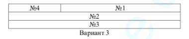

<p align = center>МИНИСТЕРСТВО НАУКИ И ВЫСШЕГО ОБРАЗОВАНИЯ

<p align = center>РОССИЙСКОЙ ФЕДЕРАЦИИ

<p align = center>ФЕДЕРАЛЬНОЕ ГОСУДАРСТВЕННОЕ БЮДЖЕТНОЕ ОБРАЗОВАТЕЛЬНОЕ УЧРЕЖДЕНИЕ ВЫСШЕГО ОБРАЗОВАНИЯ

<p align = center>«ВЯТСКИЙ ГОСУДАРСТВЕННЫЙ УНИВЕРСИТЕТ»

<p align = center>Институт математики и информационных систем

<p align = center>Факультет автоматики и вычислительной техники

<p align = center>Кафедра систем автоматизации управления


<p align = right>Дата сдачи на проверку:

<p align = right>«___» __________ 2021 г.

<p align = right>Проверено:

<p align = right>«___» __________ 2021 г.

<p align = center>Методы формирования html5 документов

<p align = center>Отчет по лабораторной работе № 1

<p align = center>по дисциплине

<p align = center>«Основы frontend-разработки и организации человеко-машинного интерфейса»

<p align = center>Вариант 3


<p align = center>Разработал студент гр. ИТб-2301-01-00 ________________ /Фищев А.В./

<p align = center>Проверил ст. преподаватель _________________ /Земцов М.А./

<p align = center>Работа защищена с оценкой	«___________» «___» __________ 2021 г.


<p align = center>Киров 2021

__________
## Цель: 

изучение методов формирования html5 документов на стороне клиента.

## Задачи:

1. Организовать рабочее пространство и процессы разработки html5 документов.
1. Изучить структуру html5 документа
1. Исследовать функциональные возможности инструментов разработчика на стороне браузера
1. Изучить типовые элементы структуры html5 документа
1. Составить отчет по выполненным задачам

## Ход выполнения:

### 1. Организовать рабочее пространство и процессы разработки html5 документов.

В ходе лабораторной работы был установлен текстовый редактор IDE Visual Studio Code, который может быть расширен и адаптирован к языку программирования через использование плагинов. Также был установлен ряд плагинов:

- VSCode All Autocomplete
- Auto Close Tag
- Auto Complete Tag
- Auto Rename Tag
- Path Intellisense
- Prettier Formatter for Visual Studio Code vscode-multiclip
- Live Server
- Kite Autocomplete Plugin for Visual Studio Code
- GitLens — Git supercharged
- Font Awesome Auto-complete & Preview
- VS Code ESLint extension
- Code Runner
- Bootstrap 4, Font awesome 4, Font Awesome 5 Free & Pro snippets for Visual studio code
- Better Comments
- Visual Studio Code CSS Intellisense for HTML
- Visual Studio Code HTML Snippets

Также была проведена регистрация на сайте github.com и изучена документация по работе с git.

В соответствии с заданием был создан репозиторий на сайте github.com с названием [“Basic frontend dev labs”](https://github.com/AntonFishchev/Basic-frontend-dev-labs). В нем была создана ветка lab1, а также директория “bfdLabs”. Директория подключена к созданному репозиторию на github.com.

### 2. Изучить структуру html5 документа

Была изучена документация по стандарту html4 и html5.

#### Задание 1: *Создайте HTML-страницу index4.html, разделенную на фреймы в соответствии с номером варианта. В качестве заголовка страницы используйте ваше имя, отчество и фамилию. Фреймы должны содержать:* 

*№1 – номер зачетной книжки;* 

*№2 – таблицу (варианты приведены на рис.3);* 

*№3 – ваше имя, отчество и фамилию;* 

*№4 – список дисциплин и преподавателей текущего семестра.*

Задание по 3 варианту представлено на рисунках 1 и 2.

<p align=center></p>

<p align = center>Рисунок 1 - Задание на реализацию web-страницы с фреймом

<p align=center></p>

<p align = center>Рисунок 2 - Задание для фрейма таблицы

В соответствии с номером варианта была реализована html-страница , представляющая разделение окна браузера на фреймы. Ссылка на фреймы - <https://github.com/AntonFishchev/Basic-frontend-dev-labs/tree/lab1/bfdLabs> . На рисунке 3 представлена html-страница index4.html, открытая в браузере.

<p align=center></p>

<p align = center>Рисунок 3 - Реализация страницы на html-4

Была проведена валидация результатов с помощью <https://validator.w3.org/#validate_by_input>. Ошибок в html страницах допущено не было (рис. 4).

<p align=center></p>

<p align = center>Рисунок 4 - Страница валидатора с проверенным кодом файла index4.html

Листинг страницы index4.html представлен в приложении А.

#### Задание 2: *Создайте файл index.html, используя html5 разметку. Файл должен реализовывать предыдущее задание с использованием языка html5. Готовым решением будет успешное прохождение проверки валидации.*

Файл index.html был успешно создан и в нем реализовано предыдущее задание с использованием языка html5. Была также проведена валидация, в ходе которой ошибок найдено не было(рис. 5).

<p align=center></p>

<p align = center>Рисунок 5 – Страница валидатора с проверенным кодом файла index.html

На рисунке 6 представлена HTML-страница index.html открытая в браузере. Листинг страницы index.html представлен в приложении Б.

<p align=center></p>

<p align = center>Рисунок 6 – Web-страница index.html


#### Выводы по эволюции стандарта html5 и принципам преобразования (конвертации) документов из стандарта html 4 в версию 5: 

В HTML5 предпринимается много других небольших усилий, таких как более четко определенные семантические роли для существующих элементов ( `<strong>` и `<em>` теперь фактически означают что-то другое, и даже `<b>` и `<i>` имеют расплывчатую семантику , которая должна хорошо работать при анализе устаревших документов) и добавление новых элементов с полезной семантикой - `<article>` , `<section>` , `<header>` , `<aside>` и `<nav>` должны заменить большинство `<div>`, используемых на веб-странице, делая ваши страницы немного более семантическими, но, что более важно, более удобными для чтения . Нет более болезненного сканирования , чтобы увидеть , что именно закрывает этот случайный `</div>` - вместо этого у вас будет очевидный `</header>` или `</article>`, что сделает структуру вашего документа гораздо более интуитивной.

### 3. Исследовать функциональные возможности инструментов разработчика на стороне браузера

В рамках лабораторной работы был рассмотрен браузер Google Chrome на основе движка рендеринга chromium. Изучена документация по работе с devtools, а конкретно описание и ключевые возможности следующих панелей:

1. __Панель Elements__

    Используется для выбора и редактирования любых HTML элементов на странице. Позволяет свободно манипулировать DOM и CSS.

    Вкладка содержит две кнопки: Выбор элемента с помощью курсора и Переключение в режим выбора устройств, она пригодится при разработке адаптивных интерфейсов, мобильных версий сайтов или для тестирования страниц с разным разрешением монитора. При выборе любого DOM элемента на вкладке Styles будет отображаться все CSS правила применяемые к нему, в том числе и неактивные. Все правила разбиты на блоки и упорядочены по убыванию специфичности селектора. Можно на лету менять значения, деактивировать и дописывать новые правила и смотреть как это влияет на отображение. Также для выбранного элемента DOM доступно еще несколько вкладок: Event Listeners — содержит все события относящиеся к данному элементу, DOM Breakpoints — точки останова для элемента и Properties — список всех свойств для элемента. Также могут быть дополнительные вкладки добавляемые расширениями для Chrome.

    __Ключевые возможности:__
    - Просмотр и редактирование в лайв режиме любого элемента DOM.
    - Просмотр и изменение CSS правил применяемых к любому выбранному элементу в панели Styles.
    - Просмотр всего списка событий и свойств для элемента на соответствующих вкладках.

    Панель Elements представлена на рисунке 7.

    <p align=center></p>

    <p align = center>Рисунок 7 – Панель Elements

0. __Панель Console__

    Необходима для логирования диагностической информации в процессе разработки или взаимодействие с JavaScript на странице. Также все ошибки в JavaScript коде, будут выводится здесь с указанием файла и конкретного места в нем где произошла ошибка. Так же в консоль можно выводить XHR запросы. Есть возможность сохранять логи в отдельный файл.
    Консоль содержит ряд инструментов и настроек для фильтрации выводимых сообщений, очистки консоли и запрета очистки логов при перезагрузке страницы — Preserve log.

    __Ключевые возможности:__

    - Использование консоли как отдельной панели или как окна рядом с любой другой панелью.
    - Возможность группировать большое колличество сообщения или выведите их на отдельных строках.
    - Очистка всех логов или сохранения их между перезагрузкой страниц, сохранение логов в отдельный файл.
    - Фильтрация по типу сообщения или по регулярному выражению.
    - Логирование XHR запросов.

    Панель Console представлена на рисунке 8.

    <p align=center></p>

    <p align = center>Рисунок 8 – Панель Console

0. __Панель Sources__

    Инструмент Sources представляет собой своего рода IDE, где мы можем посмотреть все файлы подключенные на нашей странице. Мы можем посмотреть их содержимое, отредактировать код, скопировать его или сохранить измененный файл, как новый файл. Данную вкладку можно использовать и как полноценный редактор кода подключаясь к локальным файлам через Workspaces.

    __Ключевые возможности:__

    - Отладка Вашего кода с помощью брейкпоинтов.
    - Использование браузера в качестве IDE с помощью Workspaces.
    - Запуск сниппетов с любой страницы.

    Панель Sources представлена на рисунке 9

    <p align=center></p>

    <p align = center>Рисунок 9 – Панель Sources

0. __Панель Network__

    Позволяет мониторить процесс загрузки страницы и всех файлов которые подгружаются при загрузке. Ее удобно использовать для оптимизация загрузки страниц и мониторинг запросов.
    На панели отображается таблица всех запросов к данным и файлам, над ней располагаются кнопки для фильтрации нужных Вам запросов, очистки таблицы или включения/отключения записи запросов, кнопки управления отображением таблицы. Также есть дополнительные переключатели: Preserve log — не очищать таблицу при перезагрузке страницы, Disable cache — отключить кэш браузера (будет работать только при открытом Dev Tools), Offline — эмулирует отсутствие интернета, также соседний переключатель позволяющий эмулировать скорость скачивания/загрузки данных и ping для различных типов сетей.

    Под таблицей указано количество всех запросов, общее количество загруженных данных, общее время загрузки всех данных, время загрузки и построения DOM дерева и время загрузки всех ресурсов влияющих на отображение этой страницы.

    __Ключевые возможности:__

    - Возможность отключить кэширование или установление ограничения пропускной способности.
    - Получение подробной таблицы с информацией о каждом запросе.
    - Фильтрация и поиск по всему списку запросов.

    Панель Network представлена на рисунке 10

    <p align=center></p>

    <p align = center>Рисунок 10 – Панель Network

0. __Панель Performance__

    Панель отображает таймлайн использования сети, выполнения JavaScript кода и загрузки памяти. После первоначального построения графиков таймлайн, будут доступны подробные данные о выполнение кода и всем жизненном цикле страницы. Будет возможно ознакомится с временем исполнения отдельных частей кода, появится возможность выбрать отдельный промежуток на временной шкале и ознакомится с тем какие процессы происходили в этот момент.

    Инструмент применяется для улучшение производительности работы Вашей страницы в целом.

    __Ключевые возможности:__

    - Возможность сделать запись чтобы проанализировать каждое событие, которое произошло после загрузки страницы или взаимодействия с пользователем.
    - Возможность просмотреть FPS, загрузку CPU и сетевые запросы в области Overview.
    - Щелкните по событию в диаграмме, чтобы посмотреть детали об этом.
    - Возможность изменить масштаб таймлайн, чтобы сделать анализ проще.

    Панель Performance представлена на рисунке 11

    <p align=center></p>

    <p align = center>Рисунок 11 – Панель Performance

0. __Панель Memory и JavaScript Profiler__

    Содержит несколько различных профайлеров для отслеживания нагрузки которую оказывает выполнение кода на систему:

    JavaScript CPU Profiler (был вынесен в отдельную панель JavaScript Profiler ) — позволяет узнать сколько процессорного времени занимает выполнение различных частей вашего JS кода.
    Take Heap Snapshot — показывает распределение памяти среди JS объектов и связанные с ним элементы DOM.

    Record Allocation Timeline — записывает и отображает распределение памяти между переменными в коде. Эффективен для устранения утечек памяти.

    Record Allocation Profile — записывает и отображает распределение памяти на выполнение отдельных JS функций.

    __Ключевые возможности:__

    - Исправление проблем с памятью.
    - Профилирование CPU при работе с JavaScript.

    Панель Memory и JavaScript Profiler представлена на рисунке 12

    <p align=center></p>

    <p align = center>Рисунок 12 – Панель Memory и JavaScript Profiler

0. __Панель Application__

    Вкладка для инспектирования и очистки всех загруженных ресурсов, включая IndexedDB или Web SQL базы данных, local и session storage, куков, кэша приложения, изображений, шрифтов и таблиц стилей.

    __Ключевые возможности:__

    Быстрая очистка хранилищ и кэша.
    - Инспектирование и управление хранилищами, базами данных и кэшем.
    - Инспектирование и удаление файлов cookie.

    Панель Application представлена на рисунке 13

    <p align=center></p>

    <p align = center>Рисунок 13 – Панель Application

0. __Панель Security__

    На вкладке можно ознакомится с протоколом безопасности при его наличии и просмотреть данные о сертификате безопасности, если он есть.

    Инструмент используется для отладки проблем смешанного контента, проблем сертификатов и прочее.

    __Ключевые возможности:__

    - Окно Security Overview быстро подскажет безопасна ли текущая страница или нет.
    - Возможность просмотреть отдельные источники, чтобы просмотреть соединение и детали сертификата (для безопасных источников) или узнать, какие запросы не защищены (для небезопасных источников).

    Панель Security представлена на рисунке 14

    <p align=center></p>

    <p align = center>Рисунок 14 – Панель Security

0. __Панель Audits__

    После выбора нужных настроек и нажатия кнопки Run панель аудита анализирует как загружается страница и затем предоставляет предложения по оптимизации для уменьшения времени загрузки страницы и увеличению ее отзывчивости.

    Анализируются такие параметры как: кэширование ресурсов, gzip сжатие, наличие неиспользуемых частей JS кода и CSS правил и много других параметров. Далее пользователю выводится сгруппированных список рекомендаций за счет выполнения которых можно существенно оптимизировать скорость загрузки и отзывчивости страницы.

    Панель Audits представлена на рисунке 15

    <p align=center></p>

    <p align = center>Рисунок 15 – Панель Audits

### 4. Изучить типовые элементы структуры html5 документа

Необходимо ответить на следующии вопросы:

- Какие из тегов являются тегами форматирования абзацев?
- В чем различие тегов h?
- Для чего применяется тег code как его использовать?
- В чем различие тегов code, kbd, samp, var, pre?
- В чем отличие тегов оформления цитат и определений от тегов обычного форматирования текста?
- Для чего применяются теги p, br и hr?
- Какая разница в тегах span и p?
- В чем разница между тегами b и strong?

Ответы:

- `<p>` - абзац
    `<blockquote>` - цитата
    `<pre>` - преформатированный текст
- Теги h идут с 1 по 6, обзразуют иерархическую структру логику текста на сайте. Визуально отличаются размером 
- Тег `<code>` служит для обозначения фрагментов кода.
- Тег `<kbd>` выделяет текст, вводимый пользователем. 
    Тег `<samp>` используется для вывода результата выполнения программного кода или скрипта, системных сообщений. 
    Тег `<var>` выделяет переменные из программ и отображает их курсивом. 
    Тег `<pre>` выводит текст без форматирования, сохраняя пробелы и переносы текста.
- Теги оформления цитат и определений используются для выделения неких аббревиатур, цитат(длинных и коротких), а также источника цитат.
- Эти теги применяются для разделения текста: тег `<p>` определяет текстовый абзац, тег `<br>` используется для переноса текста на новую строку, а тег `<hr>` создает горизонтальную линию для разделения параграфов.
- В отличие от тега `<p>`, тег `<span>` выделяет часть информации внутри других тегов и позволяет установить для нее свой стиль.
- Тег `<b>`, в отличие от тега `<strong>`, не придает семантического смылса выделеному тексту.

#### Задание 3: *Используя методы разметки текста реализуйте текущее расписание занятий на 2 недели. При реализации необходимо чтобы ссылки на онлайн лекции были меньше и выделены жирным курсивом, фамилия преподавателя была курсивом, а название дисциплины было h4. Использованием стилей недопустимо.*

Расписание на 2 недели было реализовано, с учетом всех требований в задании 3(рис. 16). 

Реализацию можно посмотреть по ссылке - <https://github.com/AntonFishchev/Basic-frontend-dev-labs/blob/lab1/bfdLabs/timetable.html>.

<p align=center></p>

<p align = center>Рисунок 16 – Расписание на 2 недели выполенное в рамках 3 задания

Листинг страницы timetable.html представлен в приложении В.


---

## Приложения

<p align = center> __Приложение А__

<p align = center>(обязательное) 

<p align = center>Листинг html-страницы index4.html

```html
<!DOCTYPE html PUBLIC "-//W3C//DTD HTML 4.01 Frameset//EN" "http://www.w3.org/TR/html4/frameset.dtd">
<html lang="en">
<head>
    <meta http-equiv="X-UA-Compatible" content="IE=edge">
    <meta name="viewport" content="width=\, initial-scale=1.0">
    <title>Антон Владиславович Фищев</title>
</head>
    <frameset rows = "1580px, 500px, 500px">
        <frameset cols ="30%, 70%">
            <frame src = "i4-list.html">
            <frame src = "i4-NoRecordBook.html">
        </frameset>
        <frame src = "i4-table.html">
        <frame src = "i4-fio.html">
        <noframes>
            <h1>Sorry...</h1>
        </noframes>
    </frameset>
</html>
```

<p align = center>__Приложение Б__

<p align = center>(обязательное) 

<p align = center>__Листинг html-страницы index.html__

```html
<!DOCTYPE html>
<html lang="en">
    <head>
        <meta charset="UTF-8" />
        <meta http-equiv="X-UA-Compatible" content="IE=edge" />
        <meta name="viewport" content="width=device-width, initial-scale=1.0" />
        <title>Document</title>

        <style>
            .list {
                width: 30%;
                float: left;
                height: 310px;
            }
            .No {
                width: 70%;
                float: right;
                height: 310px;
            }
            .table {
                width: 100%;
            }
            .fio {
                width: 100%;
            }
            iframe{
                width: 100%;
                height: 100%;
            }
        </style>
    </head>
    <body>
        <div class="list">
            <iframe src="i4-list.html"></iframe>
        </div>
        <div class="No">
            <iframe src="i4-NoRecordBook.html"></iframe>
        </div>
        <div class="table">
            <iframe src="i4-table.html"></iframe>
        </div>
        <div class="fio">
            <iframe src="i4-fio.html"></iframe>
        </div>
    </body>
</html>
```

<p align = center>__Приложение В__

<p align = center>(обязательное) 

<p align = center>__Листинг html-страницы timetable.html__

```html
<!DOCTYPE html>
<html lang="en">
    <head>
        <meta charset="UTF-8" />
        <meta http-equiv="X-UA-Compatible" content="IE=edge" />
        <meta name="viewport" content="width=device-width, initial-scale=1.0" />
        <title>Расписание</title>
    </head>
    <body>
        <table border="1">
            <tr>
                <th bgcolor="#fcfaec" width="100px">День</th>
                <th bgcolor="#fcfaec" width="90px">Интервал</th>
                <th bgcolor="#fcfaec" width="600px">ИТб-2301-01-00</th>
            </tr>
            <tr>
                <td rowspan="7">Понедельник<br />11.10.21</td>
                <td>08:20-9:50</td>
                <td></td>
            </tr>
            <tr>
                <td>10:00-11:30</td>
                <td>
                    <h4>Технологии программирования</h4>
                    Практическое занятие <i>Шмакова Н.А.</i> 2-202
                </td>
            </tr>
            <tr>
                <td>11:45-13:15</td>
                <td>
                    <h4>Технологии программирования</h4>
                    Практическое занятие <i>Шмакова Н.А.</i> 2-202
                </td>
            </tr>
            <tr>
                <td>14:00-15:30</td>
                <td>
                    <h4>Математика</h4>
                    Лекция <i>Левин М.Н.</i> 1-242
                </td>
            </tr>
            <tr>
                <td>15:45-17:15</td>
                <td></td>
            </tr>
            <tr>
                <td>17:20-18:50</td>
                <td></td>
            </tr>
            <tr>
                <td>18:55-20:25</td>
                <td></td>
            </tr>
            <!---->
            <tr>
                <td rowspan="7">Вторник<br />12.10.21</td>
                <td>08:20-9:50</td>
                <td></td>
            </tr>
            <tr>
                <td>10:00-11:30</td>
                <td></td>
            </tr>
            <tr>
                <td>11:45-13:15</td>
                <td></td>
            </tr>
            <tr>
                <td>14:00-15:30</td>
                <td></td>
            </tr>
            <tr>
                <td>15:45-17:15</td>
                <td></td>
            </tr>
            <tr>
                <td>17:20-18:50</td>
                <td>
                    <h4>Объектно-ориентированное программирование</h4>
                    Лекция <i>Кузьминых М.М.</i> 2-403
                </td>
            </tr>
            <tr>
                <td>18:55-20:25</td>
                <td>
                    <h4>Объектно-ориентированное программирование</h4>
                    Практическое занятие <i>Кузьминых М.М.</i> 2-403
                </td>
            </tr>
            <!---->
            <tr>
                <td rowspan="7">Среда<br />13.10.21</td>
                <td>08:20-9:50</td>
                <td></td>
            </tr>
            <tr>
                <td>10:00-11:30</td>
                <td>
                    <h4>Математика</h4>
                    Практическое занятие <i> Хохлова М.В. </i> 2-206
                </td>
            </tr>
            <tr>
                <td>11:45-13:15</td>
                <td>
                    <h4>Математика</h4>
                    Практическое занятие <i> Хохлова М.В. </i> 2-206
                </td>
            </tr>
            <tr>
                <td>14:00-15:30</td>
                <td></td>
            </tr>
            <tr>
                <td>15:45-17:15</td>
                <td></td>
            </tr>
            <tr>
                <td>17:20-18:50</td>
                <td></td>
            </tr>
            <tr>
                <td>18:55-20:25</td>
                <td></td>
            </tr>
            <!---->
            <tr>
                <td rowspan="7">Четверт<br />14.10.21</td>
                <td>08:20-9:50</td>
                <td></td>
            </tr>
            <tr>
                <td>10:00-11:30</td>
                <td>
                    <h4>Управление данными</h4>
                    Практическое занятие <i>Сергеева Е.Г.</i> 2-407
                </td>
            </tr>
            <tr>
                <td>11:45-13:15</td>
                <td>
                    <h4>Алгоритмы и структуры данных</h4>
                    Практическое занятие <i>Кашина Е.В.</i> 2-201
                </td>
            </tr>
            <tr>
                <td>14:00-15:30</td>
                <td>
                    <h4>
                        Элективные дисциплины (модули) по физической культуре и
                        спорту
                    </h4>
                    Практическое занятие Практическое занятие
                    <i> Преподаватель К.Ф.</i> 9-101
                </td>
            </tr>
            <tr>
                <td>15:45-17:15</td>
                <td></td>
            </tr>
            <tr>
                <td>17:20-18:50</td>
                <td></td>
            </tr>
            <tr>
                <td>18:55-20:25</td>
                <td></td>
            </tr>
            <!---->
            <tr>
                <td rowspan="9">Пятница<br />15.10.21</td>
                <td>08:20-9:50</td>
                <td></td>
            </tr>
            <tr>
                <td>10:00-11:30</td>
                <td></td>
            </tr>
            <tr>
                <td>11:45-13:15</td>
                <td></td>
            </tr>
            <tr>
                <td>14:00-15:30</td>
                <td></td>
            </tr>
            <tr>
                <td>15:45-17:15</td>
                <td>
                    <h4>Управление данными</h4>
                    Лекция <i> Фищева И.Н. </i> 2-209
                </td>
            </tr>
            <tr>
                <td rowspan="2">17:20-18:50</td>
                <td>
                    ИТб-2301-01-00, 01 подгруппа
                    <h4>Управление данными</h4>
                    Лабораторная работа <i> Фищева И.Н. </i>2-202
                </td>
            </tr>
            <tr>
                <td>
                    ИТб-2301-01-00, 02 подгруппа
                    <h4>Управление данными</h4>
                    Лабораторная работа <i> Фищева И.Н. </i>2-202
                </td>
            </tr>
            <tr>
                <td rowspan="2">18:55-20:25</td>
                <td>
                    ИТб-2301-01-00, 01 подгруппа
                    <h4>Управление данными</h4>
                    Лабораторная работа <i> Фищева И.Н. </i>2-202
                </td>
            </tr>
            <tr>
                <td>
                    ИТб-2301-01-00, 02 подгруппа
                    <h4>Управление данными</h4>
                    Лабораторная работа <i> Фищева И.Н. </i>2-202
                </td>
            </tr>
            <!---->
            <tr>
                <td rowspan="9">Суббота<br />16.10.21</td>
                <td>08:20-9:50</td>
                <td></td>
            </tr>
            <tr>
                <td rowspan="2">10:00-11:30</td>
                <td>
                    ИТб-2301-01-00, 01 подгруппа
                    <h4>Объектно-ориентированное программирование</h4>
                    Лабораторная работа <i>Кузьминых М.М.</i> 2-202
                </td>
            </tr>
            <tr>
                <td>
                    ИТб-2301-01-00, 02 подгруппа
                    <h4>Объектно-ориентированное программирование</h4>
                    Лабораторная работа <i>Кузьминых М.М.</i> 2-202
                </td>
            </tr>
            <tr>
                <td rowspan="2">11:45-13:15</td>
                <td>
                    ИТб-2301-01-00, 01 подгруппа
                    <h4>Объектно-ориентированное программирование</h4>
                    Лабораторная работа <i>Кузьминых М.М.</i> 2-202
                </td>
            </tr>
            <tr>
                <td>
                    ИТб-2301-01-00, 02 подгруппа
                    <h4>Объектно-ориентированное программирование</h4>
                    Лабораторная работа <i>Кузьминых М.М.</i> 2-202
                </td>
            </tr>
            <tr>
                <td>14:00-15:30</td>
                <td>
                    <h4>Объектно-ориентированное программирование</h4>
                    Практическое занятие <i>Кузьминых М.М.</i> 2-202
                </td>
            </tr>
            <tr>
                <td>15:45-17:15</td>
                <td></td>
            </tr>
            <tr>
                <td>17:20-18:50</td>
                <td></td>
            </tr>
            <tr>
                <td>18:55-20:25</td>
                <td></td>
            </tr>
            <!---->
            <tr>
                <td rowspan="7">Воскресенье<br />17.10.21</td>
                <td>08:20-9:50</td>
                <td></td>
            </tr>
            <tr>
                <td>10:00-11:30</td>
                <td></td>
            </tr>
            <tr>
                <td>11:45-13:15</td>
                <td></td>
            </tr>
            <tr>
                <td>14:00-15:30</td>
                <td></td>
            </tr>
            <tr>
                <td>15:45-17:15</td>
                <td></td>
            </tr>
            <tr>
                <td>17:20-18:50</td>
                <td></td>
            </tr>
            <tr>
                <td>18:55-20:25</td>
                <td></td>
            </tr>
            <!---->
            <tr>
                <td rowspan="9">Понедельник<br />18.10.21</td>
                <td rowspan="2">08:20-9:50</td>
                <td>
                    ИТб-2301-01-00, 01 подгруппа
                    <h4>Алгоритмы и структуры данных</h4>
                    Лабораторная работа <i>Кашина Е.В.</i> 2-202
                </td>
            </tr>
            <tr>
                <td>
                    ИТб-2301-01-00, 02 подгруппа
                    <h4>Алгоритмы и структуры данных</h4>
                    Лабораторная работа <i>Кашина Е.В.</i> 2-202
                </td>
            </tr>
            <tr>
                <td rowspan="2">10:00-11:30</td>
                <td>
                    ИТб-2301-01-00, 01 подгруппа
                    <h4>Алгоритмы и структуры данных</h4>
                    Лабораторная работа <i>Кашина Е.В.</i> 2-202
                </td>
            </tr>
            <tr>
                <td>
                    ИТб-2301-01-00, 02 подгруппа
                    <h4>Алгоритмы и структуры данных</h4>
                    Лабораторная работа <i>Кашина Е.В.</i> 2-2022
                </td>
            </tr>
            <tr>
                <td>11:45-13:15</td>
                <td>
                    <h4>Алгоритмы и структуры данных</h4>
                    Практическое занятие <i>Кашина Е.В.</i> 2-202
                </td>
            </tr>
            <tr>
                <td>14:00-15:30</td>
                <td>
                    <h4>Математика</h4>
                    Лекция <i>Левин М.Н.</i> 1-242
                </td>
            </tr>
            <tr>
                <td>15:45-17:15</td>
                <td></td>
            </tr>
            <tr>
                <td>17:20-18:50</td>
                <td></td>
            </tr>
            <tr>
                <td>18:55-20:25</td>
                <td></td>
            </tr>
            <!---->
            <tr>
                <td rowspan="7">Вторник<br />19.10.21</td>
                <td>08:20-9:50</td>
                <td></td>
            </tr>
            <tr>
                <td>10:00-11:30</td>
                <td></td>
            </tr>
            <tr>
                <td>11:45-13:15</td>
                <td></td>
            </tr>
            <tr>
                <td>14:00-15:30</td>
                <td></td>
            </tr>
            <tr>
                <td>15:45-17:15</td>
                <td>
                    <h4>Математика</h4>
                    Практическое занятие <i>Хохлова М.В.</i> 3-102
                </td>
            </tr>
            <tr>
                <td>17:20-18:50</td>
                <td>
                    ИТб-2301-01-00, 02 подгруппа
                    <h4>Технологии программирования</h4>
                    Лабораторная работа <i>Гордеев И.В.</i> 2-202
                </td>
            </tr>
            <tr>
                <td>18:55-20:25</td>
                <td>
                    ИТб-2301-01-00, 02 подгруппа
                    <h4>Технологии программирования</h4>
                    Лабораторная работа <i>Гордеев И.В.</i> 2-202
                </td>
            </tr>
            <!---->
            <tr>
                <td rowspan="7">Среда<br />20.10.21</td>
                <td>08:20-9:50</td>
                <td></td>
            </tr>
            <tr>
                <td>10:00-11:30</td>
                <td></td>
            </tr>
            <tr>
                <td>11:45-13:15</td>
                <td></td>
            </tr>
            <tr>
                <td>14:00-15:30</td>
                <td></td>
            </tr>
            <tr>
                <td>15:45-17:15</td>
                <td></td>
            </tr>
            <tr>
                <td>17:20-18:50</td>
                <td></td>
            </tr>
            <tr>
                <td>18:55-20:25</td>
                <td></td>
            </tr>
            <!---->
            <tr>
                <td rowspan="7">Четверг<br />21.10.21</td>
                <td>08:20-9:50</td>
                <td></td>
            </tr>
            <tr>
                <td>10:00-11:30</td>
                <td>
                    <h4>Алгоритмы и структуры данных</h4>
                    Лекция <i>Кашина Е.В.</i> 2-209
                </td>
            </tr>
            <tr>
                <td>11:45-13:15</td>
                <td>
                    <h4>Управление данными</h4>
                    Практическое занятие <i>Сергеева Е.Г.</i> 2-407
                </td>
            </tr>
            <tr>
                <td>14:00-15:30</td>
                <td>
                    <h4>
                        Элективные дисциплины (модули) по физической культуре и
                        спорту Практическое занятие
                    </h4>
                    Практическое занятие <i>Преподаватель К.Ф.</i> 9-101
                </td>
            </tr>
            <tr>
                <td>15:45-17:15</td>
                <td></td>
            </tr>
            <tr>
                <td>17:20-18:50</td>
                <td></td>
            </tr>
            <tr>
                <td>18:55-20:25</td>
                <td></td>
            </tr>
            <!---->
            <tr>
                <td rowspan="7">Пятница<br />22.10.21</td>
                <td>08:20-9:50</td>
                <td></td>
            </tr>
            <tr>
                <td>10:00-11:30</td>
                <td></td>
            </tr>
            <tr>
                <td>11:45-13:15</td>
                <td></td>
            </tr>
            <tr>
                <td>14:00-15:30</td>
                <td>
                    ИТб-2301-01-00, 02 подгруппа
                    <h4>Управление данными</h4>
                    Лабораторная работа <i>Фищева И.Н.</i> 2-201
                </td>
            </tr>
            <tr>
                <td>15:45-17:15</td>
                <td>
                    ИТб-2301-01-00, 02 подгруппа
                    <h4>Управление данными</h4>
                    Лабораторная работа <i>Фищева И.Н.</i> 2-201
                </td>
            </tr>
            <tr>
                <td>17:20-18:50</td>
                <td>
                    ИТб-2301-01-00, 02 подгруппа
                    <h4>Технологии программирования</h4>
                    Лабораторная работа <i>Гордеев И.В.</i> 2-309
                </td>
            </tr>
            <tr>
                <td>18:55-20:25</td>
                <td>
                    ИТб-2301-01-00, 02 подгруппа
                    <h4>Технологии программирования</h4>
                    Лабораторная работа <i>Гордеев И.В.</i> 2-309
                </td>
            </tr>
            <!---->
            <tr>
                <td rowspan="7">Суббота<br />23.10.21</td>
                <td>08:20-9:50</td>
                <td></td>
            </tr>
            <tr>
                <td>10:00-11:30</td>
                <td></td>
            </tr>
            <tr>
                <td>11:45-13:15</td>
                <td></td>
            </tr>
            <tr>
                <td>14:00-15:30</td>
                <td></td>
            </tr>
            <tr>
                <td>15:45-17:15</td>
                <td></td>
            </tr>
            <tr>
                <td>17:20-18:50</td>
                <td></td>
            </tr>
            <tr>
                <td>18:55-20:25</td>
                <td></td>
            </tr>
            <!---->
            <tr>
                <td rowspan="7">Воскресенье<br />24.10.21</td>
                <td>08:20-9:50</td>
                <td></td>
            </tr>
            <tr>
                <td>10:00-11:30</td>
                <td></td>
            </tr>
            <tr>
                <td>11:45-13:15</td>
                <td></td>
            </tr>
            <tr>
                <td>14:00-15:30</td>
                <td></td>
            </tr>
            <tr>
                <td>15:45-17:15</td>
                <td></td>
            </tr>
            <tr>
                <td>17:20-18:50</td>
                <td></td>
            </tr>
            <tr>
                <td>18:55-20:25</td>
                <td></td>
            </tr>
        </table>
    </body>
</html>
```

<p align = center>__Приложение Г__

<p align = center>(обязательное) 

<p align = center>__Библиографический список__

1. Руководство по оформлению Markdown файлов [Электронный ресурс] // URL: <https://gist.github.com/Jekins/2bf2d0638163f1294637> (дата обращения: 20.10.2021)
1. Документация по git [Электронный ресурс] // URL: <https://git-scm.com/book/ru/v2> (дата обращения: 20.10.2021)
1. Электронный курс по введению в git [Электронный ресурс] // URL: <https://githowto.com/ru> (дата обращения: 20.10.2021)
1. Введение в HTML4 [Электронный ресурс] // URL: <http://htmlbook.ru/samhtml/vvedenie-v-html> (дата обращения: 20.10.2021)
1. Теги в HTML5 [Электронный ресурс] // URL: <https://html5book.ru/html-html5/> (дата обращения: 20.10.2021)
1. Обзор всех инструментов разработчика Chrome DevTools "["Электронный ресурс"]" // URL: <https://habr.com/ru/company/simbirsoft/blog/337116/> (дата обращения: 20.10.2021)
1. Тег текста в HTML [Электронный ресурс] // URL: <https://html5book.ru/html-text/> (дата обращения: 20.10.2021)